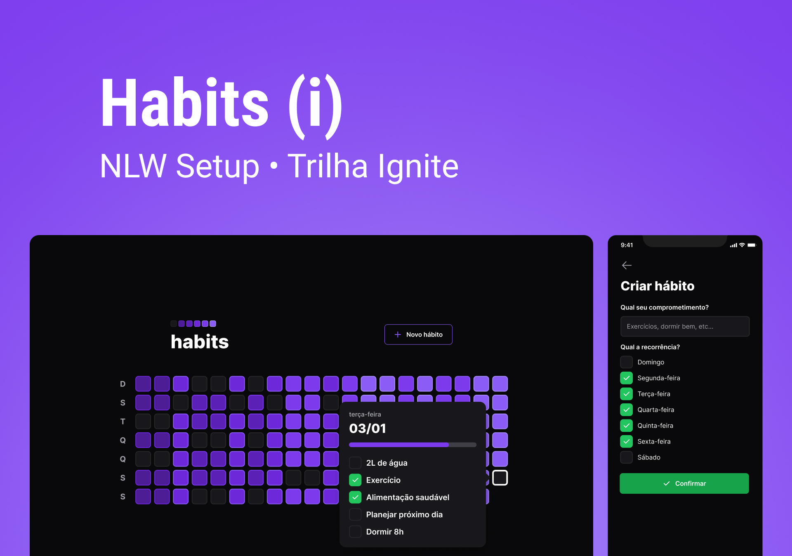

<p align="center">
  
</p>

<p align="center">
  
</p>




## Tech Stack

**Web:** React, Vite, TailwindCSS, Typescript, Radix UI

**Server:** Node, Fastify, Prisma, SQLite, zod

**Mobile:** ReactNative, Expo, ReactNative reanimated, TailwindCSS, Typescript


## Description

Fullsrack habits monitoring project done during Rocketseat's NLW Setup
## Run Locally

Clone the project

```bash
  git clone https://github.com/devRafaelGomes/NLW_Setup
```

Go to the project directory

```bash
  cd NLW_Setup
```

Go to the web

```bash
  cd web
```

Install dependencies

```bash
  npm install
```

Start the web

```bash
  npm run dev
```

Go to the mobile

```bash
  cd mobile
```

Install dependencies

```bash
  npm install
```

Start the mobile

```bash
  npx expo start
```

Go to the server

```bash
  cd server
```

Install dependencies

```bash
  npm install
```

Start the server

```bash
  npm run dev
```


## Layout

You can view the project layout through the link below:

- [Layout](https://www.figma.com/community/file/1195326661124171197) 

Remembering that you need to have an account on [Figma](http://figma.com/).


## License

This project is under the [MIT](https://choosealicense.com/licenses/mit/) license. For more details see the [LICENSE](LICENSE.md) file.
